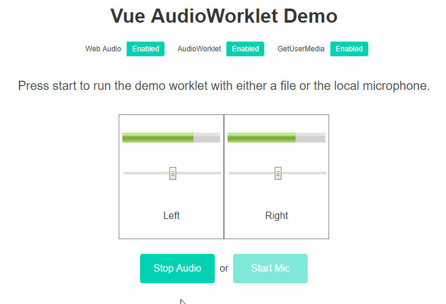

# Vue Audioworklet Demo

This is simple demo of an AudioWorklet used within a vuecli3 project loaded via webpack4 and worklet-loader.

NOTE: This demo will only work in browsers that support AudioWorklet, notably, Chrome and Opera.  



### Walkthrough ###


vue.config.js
~~~~
...
configureWebpack: {
  module: {
    rules: [
      {
        test: /Worklet.js/,  <---- change this to match your filename conventions
        loader: 'worklet-loader',
        options: {
          publicPath: publicPath   <---- will need to match vue public path
        }
      }
    ]
  }
}
...
~~~~

App.vue
~~~~

import GainWorklet from './worklet/GainWorklet'
...

try {
  await context.audioWorklet.addModule(GainWorklet)
  gainWorkletNode = new AudioWorkletNode(context, 'gain-worklet')
} catch (error) {
    // ...
} 
~~~~

The GainWorklet is a simple worklet that adjusts the gain of two input channels via two k-rate AudioParams. 

GainWorklet.js
~~~~
...
process(inputs, outputs, parameters) {
  const input = inputs[0]
  const output = outputs[0]
    
  for (let channel = 0; channel < input.length; ++channel) {
    const inputChannel = input[channel]
    const outputChannel = output[channel]
    // parameters contains our audioParams for each channel
    let gain = parameters[`gainChannel_${channel}`]
    for (let i = 0; i < inputChannel.length; ++i) outputChannel[i] = inputChannel[i] * gain[0]
  }
  return true
}
...
~~~~

Adjusting the audio params is done in the main thread via Worklet.parameters

~~~~
async updateLeftGain() {
  let gain = await this.gainWorkletNode.parameters.get('gainChannel_0')
  gain.setValueAtTime(this.leftGain, this.audioContext.currentTime)
},

async updateRightGain() {
  let gain = await this.gainWorkletNode.parameters.get('gainChannel_1')
  gain.setValueAtTime(this.rightGain, this.audioContext.currentTime)
},
~~~~

The Audio Graph you hear is simply Source -> GainWorklet -> Destination 

~~~~
source.buffer = decodedAudioData
// Connect the source buffer node to the worklet
source.connect(gainWorkletNode)
// Connect the worklet to the destination output (this is what you hear)
gainWorkletNode.connect(context.destination)
~~~~
 
The output of the GainWorklet is also routed to a ChannelSplitterNode to visualize each channel's gain. 
Each channel is connected to an analyser node.

~~~~
/ Create a splitter for the visualization
const splitter = context.createChannelSplitter(source.channelCount)
// Connect the worklet to the splitter
gainWorkletNode.connect(splitter)
~~~~

~~~~
// Add visualization that shows the gain for each channel
this.analysers = new Map()
for (let i = 0; i < source.channelCount; i++) {
    let analyser = context.createAnalyser()
    analyser.fftSize = 128
    analyser.minDecibels = -70
    analyser.maxDecibels = -25
    analyser.smoothingTimeConstant = 0.8
    this.analysers.set(i, analyser)
    splitter.connect(analyser, i, 0)
}
// Start the animations
this.updateLevels()
~~~~

The animation loop pull the levels from the analysers and sends it to the meters. 
Normally, this would be drawn directly into a canvas and not use vue's bindings. This is just an example.

~~~~
updateLevels() {
  for (let [key, analyser] of this.analysers) {
    let buffer = new Uint8Array(analyser.frequencyBinCount)
    analyser.getByteFrequencyData(buffer)
    let maxVal = 0
    for (let i = 0; i < analyser.frequencyBinCount; i++) {
      maxVal = Math.max(maxVal, buffer[i])
    }
    if (key === 0) {
      this.rightChannelLevel = maxVal
    } else {
      this.leftChannelLevel = maxVal
    }
  }
  this.animationLoopId = requestAnimationFrame(this.updateLevels)
},
~~~~


### References ###

1. [worklet-loader](https://github.com/reklawnos/worklet-loader)
2. [AudioWorklet Spec](https://webaudio.github.io/web-audio-api/#audioworklet)
3. [AudioWorklet Intro](https://developers.google.com/web/updates/2017/12/audio-worklet)
4. [Web Audio Visualizations](https://developer.mozilla.org/en-US/docs/Web/API/Web_Audio_API/Visualizations_with_Web_Audio_API)
5. [Web Audio API](https://developer.mozilla.org/en-US/docs/Web/API/Web_Audio_API)


## Project setup
```
yarn install
```

### Compiles and hot-reloads for development
```
yarn run serve
```

### Compiles and minifies for production
```
yarn run build
```